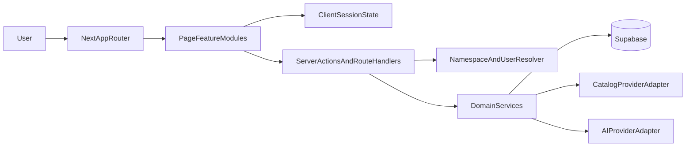

# Step 1 Implementation Plan

## Scope And Planning Assumptions

- This repo currently contains the benchmark prompt materials and `results/`, but no existing application scaffold, so this plan assumes a greenfield implementation.
- The plan is based on the full available Step 1 corpus in `docs/prd/`. `product_prd.md` references companion docs that are not present in this workspace, so the plan treats the available supporting docs as the authoritative benchmark input set.
- The deliverable is planning-only. No application implementation is proposed here beyond architecture, sequencing, and test strategy.

## Spec Drivers

- [docs/prd/product_prd.md](docs/prd/product_prd.md) defines the product surface area: collection management, search, `Ask`, `Alchemy`, per-show `Explore Similar`, detail pages, person pages, settings, and backup/export.
- [docs/prd/infra_rider_prd.md](docs/prd/infra_rider_prd.md) makes the build constraints explicit: `Next.js` latest stable, `Supabase`, env-only setup, server-side source of truth, and strict `(namespace_id, user_id)` isolation.
- [docs/prd/supporting_docs/technical_docs/storage-schema.md](docs/prd/supporting_docs/technical_docs/storage-schema.md) and [docs/prd/supporting_docs/technical_docs/storage-schema.ts](docs/prd/supporting_docs/technical_docs/storage-schema.ts) define the durable model, transient fetches, and per-field merge semantics that must anchor the backend design.
- [docs/prd/supporting_docs/ai_prompting_context.md](docs/prd/supporting_docs/ai_prompting_context.md), [docs/prd/supporting_docs/ai_voice_personality.md](docs/prd/supporting_docs/ai_voice_personality.md), [docs/prd/supporting_docs/concept_system.md](docs/prd/supporting_docs/concept_system.md), [docs/prd/supporting_docs/detail_page_experience.md](docs/prd/supporting_docs/detail_page_experience.md), and [docs/prd/supporting_docs/discovery_quality_bar.md](docs/prd/supporting_docs/discovery_quality_bar.md) define the AI contracts, detail-page hierarchy, concept rules, and quality bar that should drive discovery architecture and test coverage.

## Product Breakdown

The product naturally splits into three tightly coupled systems:

1. A durable personal library where the user's version of a show always wins.
2. A catalog and discovery layer spanning Search, Ask, Explore Similar, and Alchemy.
3. An AI contract layer that must stay on-brand, spoiler-safe, structured when needed, and grounded in real catalog entities.

The most important implementation consequence is that these systems cannot be designed independently. Persistence, catalog hydration, AI resolution, and UI entry points all need to share one consistent show model and one set of business rules.

## Proposed Architecture

- Use `Next.js` App Router for route entrypoints in [src/app/](src/app/) while keeping product features in fractal modules under [src/pages/](src/pages/) to match [INSTRUCTIONS.md](INSTRUCTIONS.md): thin route files, humble components, and hooks/services co-located with each page or feature.
- Put cross-cutting business logic in [src/server/](src/server/) and [src/lib/](src/lib/): identity resolution, Supabase repositories, catalog adapters, AI adapters, merge logic, validation/parsing, and export assembly should not live inside TSX.
- Partition persistence around durable user state only. `Show`, `CloudSettings`, and `AppMetadata` should be persisted; chat history, mention strips, Alchemy outputs, and AI recommendation reasons should stay session-scoped in client/server session state.
- Treat the show-detail experience as the integration hub. The plan should build the domain model and merge engine before the dense detail page so that status, tags, rating, scoop, recommendations, and provider data all resolve from one consistent show shape.

## Domain Model And Data Responsibilities

- `Show` is the central durable entity and must combine public catalog data with user-owned overlay fields such as `myStatus`, `myInterest`, `myTags`, `myScore`, and `aiScoop`.
- Merge semantics must be centralized in one domain service:
  - Public fields use first-non-empty merge behavior.
  - User-owned fields resolve by per-field timestamps.
  - `creationDate` is set once.
  - `detailsUpdateDate` refreshes whenever catalog details merge.
- The effective storage partition is `(namespace_id, user_id)`, so every user-owned record and destructive reset path must flow through explicit identity context.
- Only durable data should be persisted. Credits, seasons, images, videos, recommendations, similar items, Ask history, mentioned shows, Alchemy results, and transient recommendation reasons should remain re-fetchable or session-scoped.
- Export/backup should serialize the durable model into a `.zip` containing JSON with ISO-8601 dates.

## Target File Layout

- Route shell and pages: [src/app/layout.tsx](src/app/layout.tsx), [src/app/page.tsx](src/app/page.tsx), [src/app/find/page.tsx](src/app/find/page.tsx), [src/app/shows/[id]/page.tsx](src/app/shows/[id]/page.tsx), [src/app/people/[id]/page.tsx](src/app/people/[id]/page.tsx), [src/app/settings/page.tsx](src/app/settings/page.tsx).
- Feature modules: [src/pages/CollectionHome/CollectionHome.tsx](src/pages/CollectionHome/CollectionHome.tsx), [src/pages/Find/Find.tsx](src/pages/Find/Find.tsx), [src/pages/ShowDetail/ShowDetail.tsx](src/pages/ShowDetail/ShowDetail.tsx), [src/pages/PersonDetail/PersonDetail.tsx](src/pages/PersonDetail/PersonDetail.tsx), [src/pages/Settings/Settings.tsx](src/pages/Settings/Settings.tsx).
- Nested feature structure should follow the fractal pattern from [INSTRUCTIONS.md](INSTRUCTIONS.md), for example:
  - `src/pages/ShowDetail/features/StatusToolbar/`
  - `src/pages/ShowDetail/features/RatingControl/`
  - `src/pages/ShowDetail/features/TagManager/`
  - `src/pages/ShowDetail/features/ScoopPanel/`
  - `src/pages/ShowDetail/features/ExploreSimilar/`
  - `src/pages/Find/features/SearchMode/`
  - `src/pages/Find/features/AskMode/`
  - `src/pages/Find/features/AlchemyMode/`
- Server/domain modules: [src/server/auth/](src/server/auth/), [src/server/shows/](src/server/shows/), [src/server/discovery/](src/server/discovery/), [src/server/settings/](src/server/settings/), [src/server/export/](src/server/export/), [src/server/catalog/](src/server/catalog/), [src/server/ai/](src/server/ai/).
- Shared UI and theme primitives: [src/components/](src/components/), [src/theme/](src/theme/), [src/config/](src/config/), [src/utils/](src/utils/), [src/hooks/](src/hooks/).
- Infra artifacts: [.env.example](.env.example), [supabase/migrations/](supabase/migrations/), [package.json](package.json), and a namespace reset entrypoint such as [scripts/reset-namespace.ts](scripts/reset-namespace.ts).

## Delivery Phases

1. Foundation and repo scaffolding.

Create the Next.js app shell, design-token/theme layer, environment contract, Supabase client setup, migration workflow, and benchmark-friendly identity injection. This phase should also establish route skeletons and shared UI primitives so later features do not invent competing patterns.

2. Data model, persistence, and merge engine.

Implement the persistent schema around `shows`, `cloud_settings`, and `app_metadata`; enforce composite partitioning by `namespace_id` and `user_id`; and centralize merge rules so public catalog refreshes cannot overwrite `myStatus`, `myInterest`, `myTags`, `myScore`, or `aiScoop`. This phase should also cover export serialization and the namespace-scoped reset path required by the rider.

3. Collection and search backbone.

Build Collection Home, filter state, tag-derived navigation, media-type toggles, and catalog Search first because these are the entry points for the highest-frequency user journeys. Wire all save triggers now: status save, interest save, rating-to-save as `Done`, and tag-to-save as `Later + Interested`.

4. Show detail and person detail.

Implement the detail page in the narrative order required by [docs/prd/supporting_docs/detail_page_experience.md](docs/prd/supporting_docs/detail_page_experience.md): header media, quick facts, personal controls, overview, Scoop, Ask handoff, recommendations, concepts, providers, cast/crew, and media-specific sections. Person Detail can follow once credits navigation and catalog hydration are stable.

5. AI discovery surfaces.

Add `Ask`, `Explore Similar`, `Alchemy`, and Scoop on top of the stable collection/catalog backbone. Each surface should go through typed request builders, strict output parsers, and recommendation resolution so AI text never bypasses real-show mapping rules. Keep persona consistency in one shared prompt-contract layer and make session-only data boundaries explicit.

6. Settings, backup, and hardening.

Finish synced/local settings, API key/model configuration, backup export, empty states, loading/error states, and regression protection. This phase should also tighten quality against the discovery quality bar and benchmark runtime expectations.

## Feature-By-Feature Plan

### Collection Home

- Implement filtered collection views grouped into `Active`, `Excited`, `Interested`, and remaining statuses.
- Support tag-driven filters, `No tags`, genre filters, decade filters, community score filters, and the global media-type toggle.
- Surface in-collection and rating badges consistently on show tiles.
- Ensure empty states route users back to Search or Ask.

### Search

- Build a straightforward catalog search mode with no AI personality.
- Mark in-collection items using the persisted overlay data.
- Route all results into the canonical Show Detail page.
- Support `Search on Launch` from settings via local UI state.

### Show Detail

- Treat Show Detail as the single source of truth for both saved and unsaved shows.
- Implement the first-15-seconds hierarchy from the supporting doc: mood-setting media, quick facts, personal relationship controls, overview, and Scoop affordance.
- Keep destructive removal behavior behind confirmation with a remembered opt-out flag.
- Ensure tagging, rating, and status changes all funnel through the same save semantics service.

### Person Detail

- Support bio, gallery, basic analytics, and year-grouped credits.
- Reuse shared tile/navigation primitives so credit selection re-enters the normal Show Detail pipeline.

### Ask

- Separate general Ask from `Ask about this show`, but route both through one conversation engine and one voice contract.
- Use structured mention parsing for the mentioned-shows strip with exact `Title::externalId::mediaType` formatting.
- Summarize older turns after roughly 10 messages while preserving persona tone.
- Keep conversation data session-only.

### Explore Similar

- Generate a concept set for a single show.
- Require 1+ selected concepts before recommendation generation.
- Return exactly 5 recommendations with reasons tied directly to the chosen concepts.
- Resolve every recommendation to a real catalog entity or fall back to non-interactive display/Search handoff.

### Alchemy

- Support selection of 2+ input shows from saved items and the global catalog.
- Generate a larger shared concept pool than Explore Similar while capping user selection at 8.
- Clear downstream concepts/results when seed inputs change.
- Return exactly 6 recommendations per round and support chained sessions without persisting results.

### Scoop

- Generate on demand from Show Detail.
- Stream progressively if supported by the UI stack.
- Persist only when the show is in the collection.
- Use freshness logic around the 4-hour window before regeneration.

### Settings And Backup

- Split local-only convenience settings from optionally synced settings.
- Keep API keys out of version control and configurable via environment variables.
- Support export of all durable user data as a zipped JSON backup.

## Cross-Cutting Decisions

- Use server-side repositories and service objects for any rule with data consequences: auto-save defaults, remove-from-collection semantics, AI Scoop persistence, merge timestamps, export generation, and test reset should each have one authoritative implementation path.
- Keep client components presentation-first. Hooks should orchestrate UI state, but Supabase writes, AI calls, and catalog fetch/merge behavior should go through server boundaries to protect secrets and prevent duplicated business logic.
- Model AI surfaces as contracts, not free-form prompts. `Ask with mentions`, concepts, concept-based recs, and Scoop should each have schema validation, one retry path for malformed output, and a Search/non-interactive fallback when catalog resolution fails.
- Treat discovery quality as testable behavior. Real-show integrity is non-negotiable, and concept/reason specificity should be covered by fixture-driven tests plus a lightweight golden-set harness for manual review.
- Favor small modules over large page files: route entrypoints should compose feature modules, and each meaningful work unit should have its own hook/service/parser/repository file rather than accumulating broad utilities or long components.

## Testing Strategy

- Unit tests: merge rules, auto-save defaults, removal semantics, concept/result parsers, catalog-to-show mapping, export date encoding, and namespace/user scoping.
- Integration tests: collection CRUD flows, Search-to-Detail save flows, detail-page data hydration, AI fallback behavior, and backup export.
- End-to-end smoke tests: build collection, rate-to-save, tag-to-save, Ask discovery, Explore Similar, Alchemy, and namespace-scoped reset.
- Operational checks: confirm `.env.example` completeness, no secret leakage, browser-only anon key usage, and repeatable migrations/reset without global teardown.
- Manual quality review: use the discovery quality bar to check voice adherence, taste alignment, surprise without betrayal, specificity of reasoning, and real-show integrity across Ask, Scoop, Explore Similar, and Alchemy.

## Primary Risks To Manage

- Merge correctness between public catalog data and user-owned fields.
- Subtle divergence in implicit save/remove behaviors across Search, Detail, Ask, and AI recommendation entry points.
- AI output parsing and real-catalog resolution failures.
- Detail-page complexity causing duplicate fetches or inconsistent state.
- Blurring session-only discovery state with durable storage.
- Missing or drifting AI voice between surfaces if prompt contracts are duplicated rather than centralized.

## Definition Of Done

- The app runs via env configuration only, on `Next.js` + `Supabase`, with namespace-safe persistence and reset tooling.
- All major PRD journeys are implemented: collection, search, detail, person, Ask, Explore Similar, Alchemy, settings, and export.
- User-owned fields always win, destructive actions are scoped and confirmed, and AI recommendations remain actionable and on-brand.
- Tests cover the merge engine, save semantics, AI contracts, and namespace isolation strongly enough to protect future benchmark reruns.
